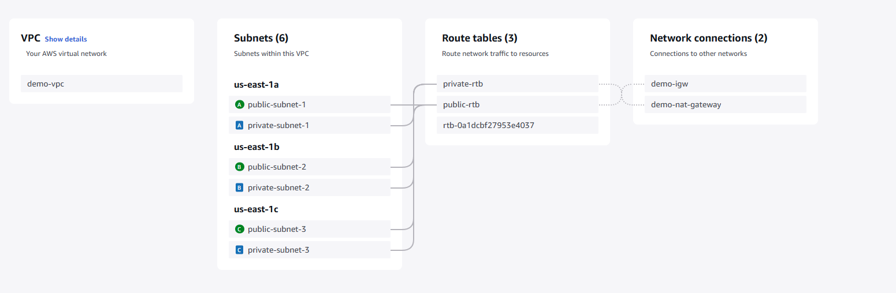

# AWS VPC Setup

This project provisions a VPC with public and private subnets across three availability zones. It also includes an Internet Gateway, a NAT Gateway, and the necessary route tables.

## Infrastructure Details

1. **VPC:** Created with CIDR `10.0.0.0/16`.
2. **Subnets:**  
   - Public and private subnets deployed in **3 Availability Zones**.
   - **Private Subnets:**  
     - `10.0.1.0/24`  
     - `10.0.2.0/24`  
     - `10.0.3.0/24`  
   - **Public Subnets:**  
     - `10.0.101.0/24`  
     - `10.0.102.0/24`  
     - `10.0.103.0/24` 
3. **Internet Gateway:**  
   - Attached to the VPC for public subnet internet access.
4. **NAT Gateway:**  
   - Deployed for outbound traffic from private subnets.
5. **Route Tables:**  
   - Configured for proper routing between public and private subnets.

## Usage

- Ensure you have **Terraform/AWS CLI** installed.
- Apply the configuration using:

  terraform init
  terraform validate
  terraform plan
  terraform apply

